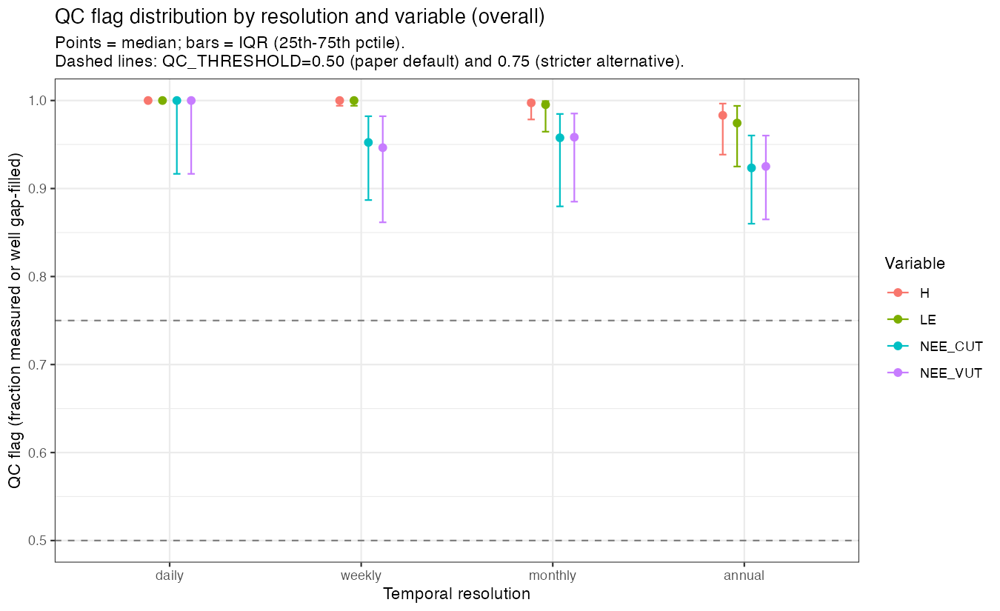
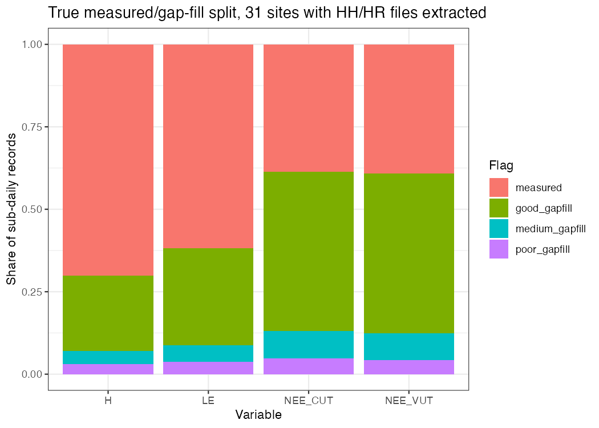
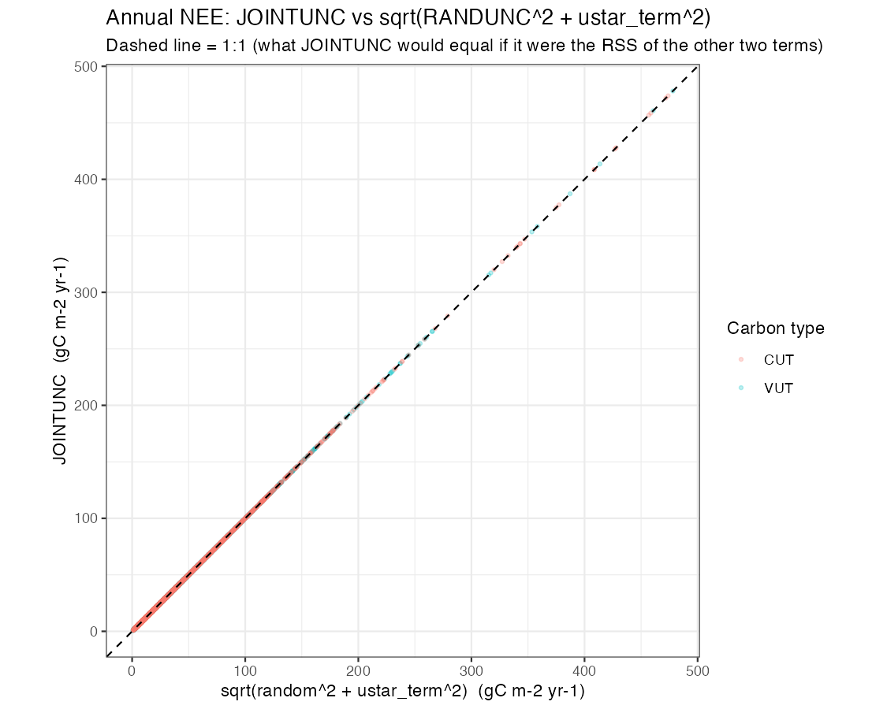
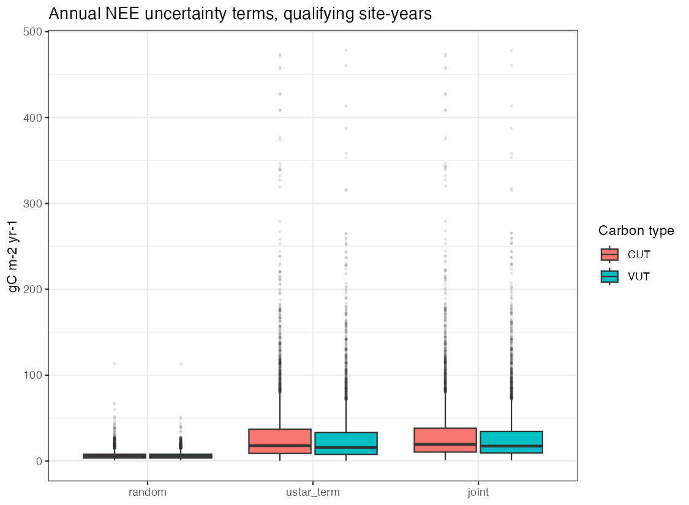
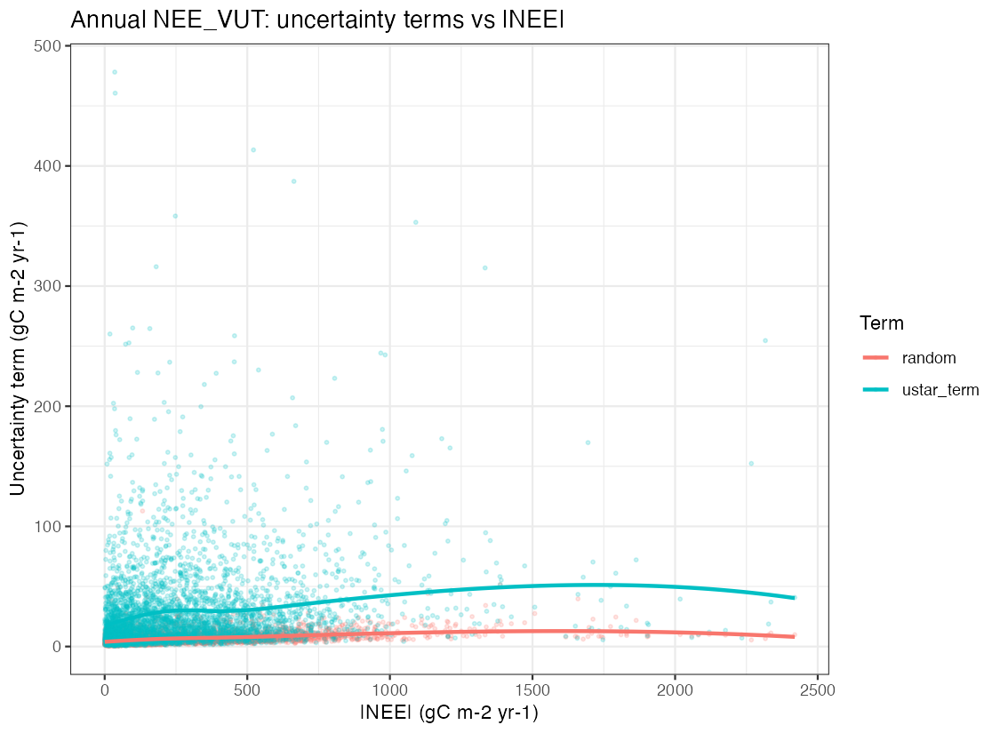
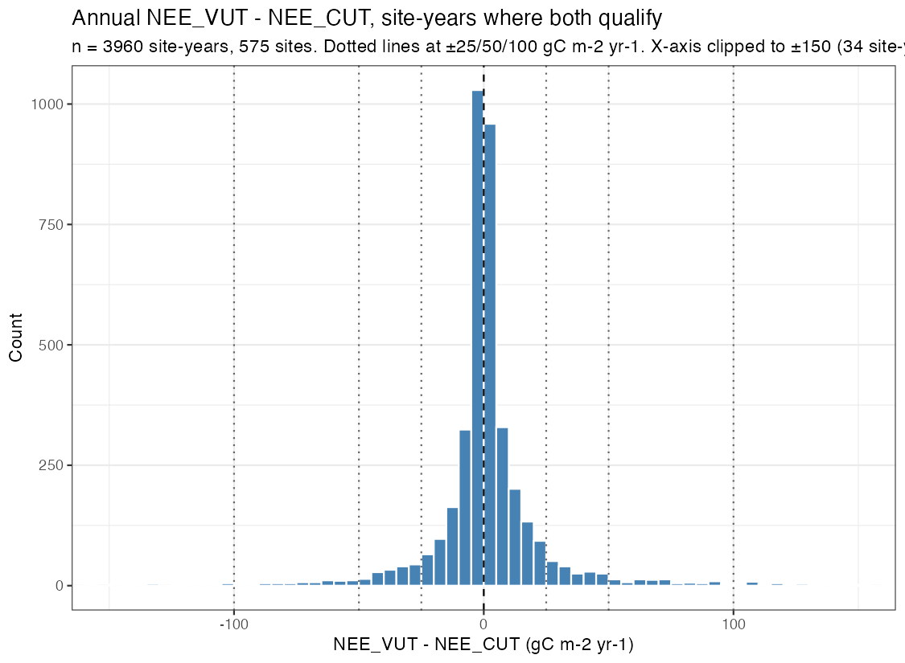
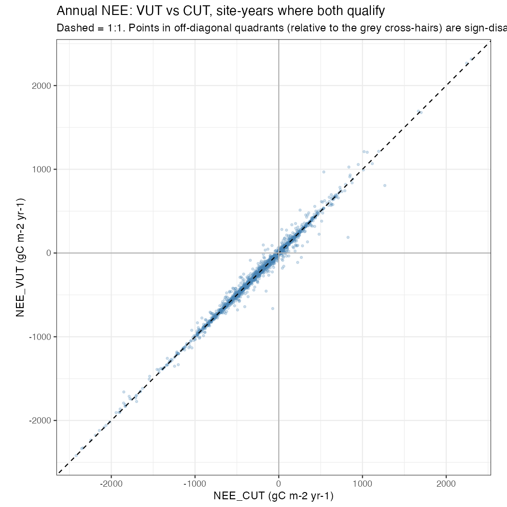
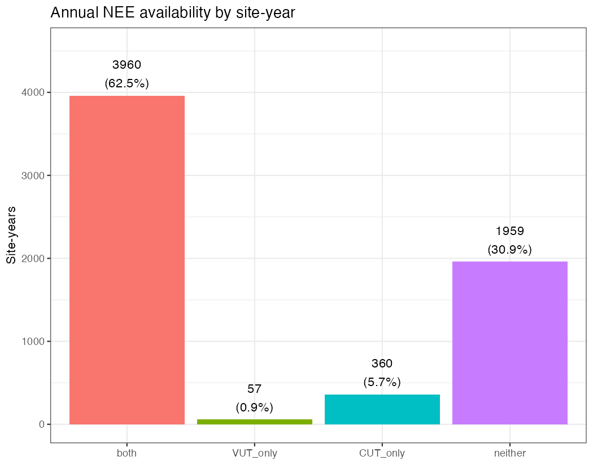
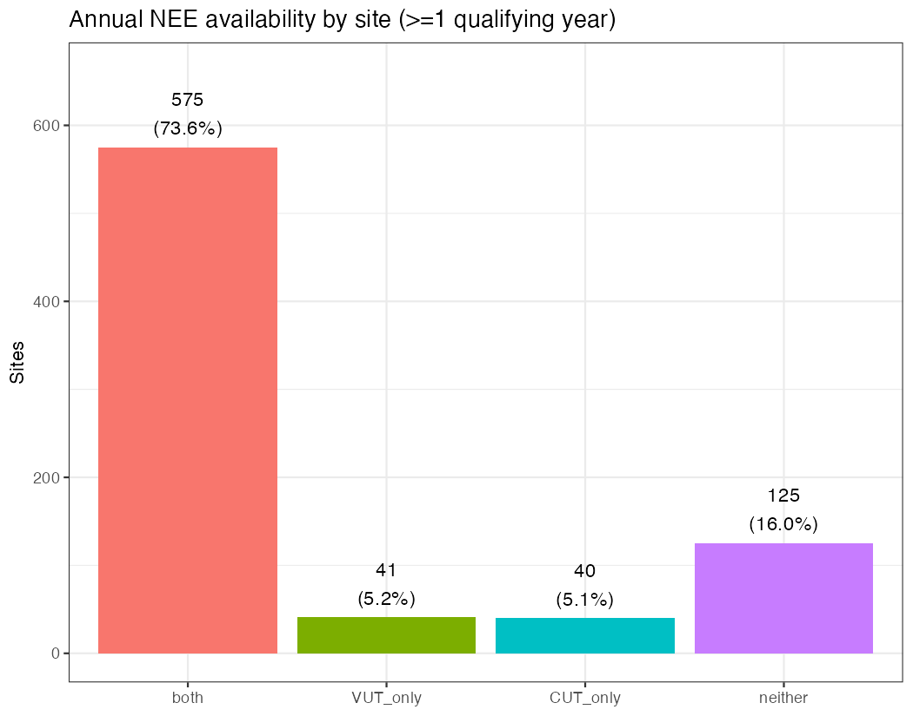

# Data quality and uncertainty across the network (781 sites)

*Diagnostic only. Reads the pre-QC DuckDB tables (`dataset = 'FLUXMET'`) — never
`*_qc` or `*_converted`. Does not touch paper figures, snapshots, or metrics files.*

## Summary

*(Placeholder — this section is rewritten once all stages are complete, per the
task's closing instruction. See `status.md` for the current run state.)*

---

## Stage 0 — Inventory

**Scope:** annual, monthly, weekly, daily DuckDB tables, `dataset = 'FLUXMET'`, 781 sites.

**Outputs:** `table_stage0_column_inventory.csv`, `table_stage0_hh_hr_sites.csv`,
`table_stage0_bif_ustar_summary.csv`, `table_stage0_bif_ustar_site_summary.csv`.

### Column inventory

For NEE (VUT, CUT), LE and H, checked: reference value, QC flag, random uncertainty
(`_RANDUNC`), joint uncertainty (`_JOINTUNC`), the u-star percentile columns
(`_05`…`_95`), `_USTAR50`, `_MEAN`, `_SE`, and — for LE/H — the energy-balance-corrected
`_CORR` value with its own spread columns (`_CORR_25`, `_CORR_75`, `_CORR_JOINTUNC`).
Full combination-by-combination result (table × family × category) is in
`table_stage0_column_inventory.csv`; `n_sites_with_data` is `count(distinct site_id)`
with at least one non-NA value for that column, at that resolution.

**Present everywhere (all four resolutions), for both NEE_VUT and NEE_CUT:**
reference value, QC flag, random uncertainty, joint uncertainty, all seven u-star
percentile columns, USTAR50, MEAN, SE. These form the full FLUXNET u-star-threshold
perturbation ensemble (the percentile/MEAN/SE/USTAR50 family) plus the two named
single-value uncertainty terms (`_RANDUNC`, `_JOINTUNC`) on the REF value. At the
annual step, counts range ~615–618 sites for the REF/QC/RANDUNC/JOINTUNC group and
~617–732 for the ensemble-statistic columns (MEAN/SE/percentiles) — i.e. **more sites
carry the u-star ensemble statistics than carry a usable REF value** (732 vs 616 sites
for `NEE_VUT_SE` vs `NEE_VUT_REF` at the annual step). This is a real asymmetry, not a
join artefact: `NEE_VUT_REF` is the single percentile selected by ONEFlux's combined
CP/MP method, which can fail (see Stage 4) even when the broader percentile ensemble
still has values.

**Present everywhere, for LE and H:** reference value (`LE_F_MDS`/`H_F_MDS`), QC flag,
random uncertainty (`LE_RANDUNC`/`H_RANDUNC`), and the energy-balance-corrected value
itself (`LE_CORR`/`H_CORR`, ~436–437 sites at the annual step — substantially fewer
than the ~665–669 sites holding the uncorrected `LE_F_MDS`/`H_F_MDS`, since the
correction needs a successful energy-balance closure fit).

**Absent everywhere (genuinely absent from the FLUXNET product, not dropped at
ingest — see below), for LE and H at every resolution:** `_JOINTUNC` (uncorrected),
all seven percentile columns, `_USTAR50`, `_MEAN`, `_SE`. LE/H carry no u-star-threshold
perturbation ensemble and no named joint-uncertainty term on the uncorrected value —
only `_RANDUNC`. This matches the physical picture: the u-star ensemble exists because
u-star filtering is a NEE/GPP/RECO-specific correction; LE and H are not u-star-filtered
in the same way.

**Resolution-dependent — energy-balance-corrected spread columns:** `LE_CORR_25`,
`LE_CORR_75`, `LE_CORR_JOINTUNC` (and the H equivalents) exist **only in the daily
table**; absent from annual, monthly and weekly. So a per-period uncertainty estimate
on the corrected LE/H value is only available at daily resolution — Stage 2's "whatever
uncertainty columns exist" for LE/H is consequently a daily-only exercise for the
corrected variables, annual/monthly/weekly-only for the uncorrected `_RANDUNC`.

**Ingest check:** two sample extracted annual CSVs (`AR-Bal`, CUT-only, 198 columns;
`US-MMS`, VUT+CUT+ensemble, 317 columns) were diffed against the DB's column set —
every column in both files is present in the DB, and DuckDB ingest uses
`union_by_name` across all files at a resolution, so the DB's column set is already
the union of every site's own header. An absent-from-DB column therefore cannot be
present in any individual extracted file either: the LE/H absences above are real
absences in the FLUXNET product, not an ingest drop.

### Sub-daily (HH/HR) file extraction

**31 of 781 sites** have sub-daily FLUXMET files extracted on disk (30 at HH
half-hourly, 1 at HR hourly — `US-MMS`), per a live `flux_discover_files()` scan of
`data/extracted` (`table_stage0_hh_hr_sites.csv`). This is expected: `CLAUDE.md`'s
pipeline default is `FLUXNET_EXTRACT_RESOLUTIONS="y m d"` (no `h`), so the vast
majority of sites were never extracted at sub-daily resolution; these 31 are evidently
leftover from earlier ad hoc/test extractions. The DuckDB store's own `manifest` table
is stale on this point — it records **zero** HH/HR FLUXMET files — because it reflects
whatever was on disk when `03b_create_database.R` last ran, not current disk state.
Stage 1's sub-daily QC comparison is therefore based on these same 31 sites, read
directly from the extracted CSVs (not from the DB `hourly` table, which itself holds a
full ingested copy of only one of the 31 — `US-MMS`).

### BIF (BADM) u-star threshold / method records

All **781/781** sites have a `VARIABLE_GROUP = 'GRP_UST_THR'` group in their BIF file.
Variables found (`table_stage0_bif_ustar_summary.csv`): `USTAR_CP_SUCCESS_RUN` and
`USTAR_MP_SUCCESS_RUN` (one flag per year, CP = change-point method, MP = moving-point
method — 6336 site-year records each, matching the 6336 FLUXMET annual site-years
inventoried in Stage 0's column check), their `_YEAR` companions, `USTAR_PERCENTILE`,
`USTAR_PERCENTILE_YEAR`, `USTAR_THRESHOLD` and `USTAR_VERSION` (291797 records each —
one row per percentile/threshold estimate, i.e. the per-year, per-percentile detail
behind the annual ensemble columns above). A compact per-site success/failure count
for CP and MP is in `table_stage0_bif_ustar_site_summary.csv`; Stage 4 uses this to
tabulate u-star method failures.

### Hub-grouping decision

`CLAUDE.md` Hard Rule 2 prohibits inferring hub membership from site-ID prefixes and
says to use the manifest/snapshot "network" field instead. The manifest/snapshot
actually carries two distinct fields: `network` (a semicolon-separated list of every
community network a site has ever belonged to, e.g. `"AmeriFlux;NEON;Phenocam"` — not
usable as a single grouping key) and `data_hub` (single-valued: `AmeriFlux`/`ICOS`/
`TERN`/etc — the actual distributing hub, as used by `flux_discover_files()` and
`01_download.R`). Existing diagnostics in this repo
(`scripts/diagnostics/koppen_pi_vs_era5.R`, `era5_precip_units.R`) already
`group_by(data_hub)` for "by hub" breakdowns. **All "by hub" tabulations in Stages 1–4
of this diagnostic use `data_hub`**, matching that precedent — it is manifest-derived
from the download source, not inferred from site-ID prefixes, so it satisfies Hard
Rule 2's intent despite not being the literally-named `network` column.

---

## Stage 1 — Gaps

**Scope:** daily, weekly, monthly, annual DuckDB tables, `dataset = 'FLUXMET'`;
QC flag = `NEE_VUT_REF_QC`, `NEE_CUT_REF_QC`, `LE_F_MDS_QC`, `H_F_MDS_QC`.

**Outputs:** `table_stage1_qc_distribution.csv` (overall + by IGBP + by hub, all four
resolutions), `table_stage1_subdaily_qc_by_site.csv`,
`table_stage1_subdaily_qc_network_summary.csv`,
`table_stage1_subdaily_vs_network_igbp.csv`, `table_stage1_subdaily_vs_network_hub.csv`,
`fig_stage1_qc_flag_distribution.png`, `fig_stage1_subdaily_qc_split.png`.

**At DD/WW/MM/YY resolution the QC flag is the fraction of underlying half-hourly/
hourly records that were measured or good-quality gap-filled — it cannot distinguish
"all measured" from "all MDS-gap-filled" within that fraction** (CLAUDE.md QC Flag
Reference, System 1). A site-period with `QC = 0.95` could be 95% directly measured,
or 95% high-confidence gap-fill, or any mixture; this stage's distributions describe
that fraction only, not the measured/gap-filled split itself (that split is only
recoverable from sub-daily files — see below).

### Flag distribution, overall

| Resolution | Variable | n site-periods | median | share ≥ 0.50 | share ≥ 0.75 | share = 1 |
|---|---|---:|---:|---:|---:|---:|
| daily | NEE_VUT | 1,860,909 | 1.00 | 0.903 | 0.858 | 0.508 |
| daily | NEE_CUT | 2,002,221 | 1.00 | 0.897 | 0.852 | 0.507 |
| daily | LE | 2,062,532 | 1.00 | 0.922 | 0.905 | 0.775 |
| daily | H | 2,085,934 | 1.00 | 0.931 | 0.917 | 0.814 |
| weekly\* | NEE_VUT | 1,300 | 0.946 | 0.972 | 0.888 | 0.071 |
| weekly\* | NEE_CUT | 1,300 | 0.952 | 0.983 | 0.920 | 0.084 |
| weekly\* | LE | 1,300 | 1.00 | 0.997 | 0.986 | 0.682 |
| weekly\* | H | 1,300 | 1.00 | 0.997 | 0.988 | 0.677 |
| monthly | NEE_VUT | 59,890 | 0.958 | 0.938 | 0.866 | 0.019 |
| monthly | NEE_CUT | 64,441 | 0.958 | 0.932 | 0.857 | 0.020 |
| monthly | LE | 66,409 | 0.995 | 0.952 | 0.905 | 0.194 |
| monthly | H | 67,262 | 0.997 | 0.959 | 0.917 | 0.268 |
| annual | NEE_VUT | 4,033 | 0.925 | 0.996 | 0.929 | 0.000 |
| annual | NEE_CUT | 4,352 | 0.923 | 0.993 | 0.921 | 0.000 |
| annual | LE | 4,509 | 0.974 | 0.998 | 0.974 | 0.002 |
| annual | H | 4,638 | 0.983 | 0.998 | 0.981 | 0.005 |

\* **Weekly resolution has only 1 site (`US-MMS`) in the current DuckDB store** — it
is not a network-representative sample, unlike daily/monthly/annual (781 sites each).
`CLAUDE.md`'s default `FLUXNET_EXTRACT_RESOLUTIONS="y m d"` does not include weekly
extraction; this single site's weekly table appears to be left over from an earlier
ad hoc extraction. Treat the weekly row as a single-site case study only.

At every real (781-site) resolution, LE and H are flagged "good" (QC ≥ 0.75) more
consistently than either NEE variant — e.g. at the annual step, `share_eq_1` is
essentially 0 for NEE_VUT/CUT but LE/H still reach 0.002/0.005 (small but nonzero: a
handful of site-years are 100% measured-or-good for the meteorological driver but
never for NEE). `share_ge_050` (the paper's actual QC_THRESHOLD_YY/MM/DD/WW gate) is
≥0.99 for NEE at daily→annual, meaning the QC_THRESHOLD=0.50 filter used by
`04_qc.R` retains the overwhelming majority of site-periods; the stricter 0.75
alternative removes a further ~7 percentage points at the annual step (0.929 → the
complement, ~7%, would additionally fail).

### By IGBP class and by hub (annual step, NEE_VUT; full table in the CSV)

By IGBP class, median annual QC ranges from 0.849 (SNO, n=3 — too few site-years to
be meaningful) and 0.894 (OSH, n=194) up to 0.941 (WSA, n=152) and 0.940 (CVM, n=26).
Forest and wetland classes (ENF, DBF, WET) cluster around a median of 0.91–0.93;
cropland/grassland (CRO, GRA) run slightly higher (~0.93–0.94). By hub: AmeriFlux
sites have the lowest median annual QC (0.917, n=1719 site-years), ICOS intermediate
(0.930, n=2042), TERN highest (0.940, n=272) — a modest but consistent ordering,
visible in every variable and most resolutions (`table_stage1_qc_distribution.csv`).

### Sub-daily ground truth: the true measured/gap-fill split

The 31 sites with HH/HR files extracted (Stage 0) give 5,145,912 pooled sub-daily
records with integer QC flags (0=measured, 1=good gap-fill (MDS), 2=medium, 3=poor).
Pooled network split:

| Variable | measured | good gap-fill | medium gap-fill | poor gap-fill |
|---|---:|---:|---:|---:|
| H | 70.2% | 22.8% | 4.0% | 3.1% |
| LE | 61.9% | 29.3% | 5.1% | 3.7% |
| NEE_CUT | 38.6% | 48.3% | 8.3% | 4.8% |
| NEE_VUT | 39.1% | 48.5% | 8.1% | 4.2% |

NEE is majority gap-filled even at the "good" level — only ~39% of half-hourly NEE
records are direct measurements, versus ~62–70% for LE/H. This matches the physical
expectation: NEE requires turbulent-flux quality screening (u-star filtering, among
other QA/QC) that LE/H do not, so a much larger share of NEE half-hours are excluded
and gap-filled. The DD/WW/MM/YY QC flag (which cannot separate measured from good
gap-fill) therefore masks a real quality difference: a site-period with `QC ≈ 0.95`
for NEE is mostly gap-filled flux, not mostly measured flux, in a way the same `QC`
value for LE/H typically is not.

**This 31-site subset is not representative of the network by hub**, though it is
roughly representative by IGBP class. IGBP shares track the network closely (e.g. GRA
19.4% of the subset vs 18.7% network-wide, CRO 16.1% vs 17.8%; `OSH`, `MF`, `SAV`,
`CSH`, `SNO` — 10% of the network between them — are entirely unrepresented in the
31, a real gap but a small one). By hub, the subset is strongly ICOS-skewed: ICOS is
74.2% of the 31 sites but only 44.6% of the network; AmeriFlux is only 19.4% of the
31 sites despite being 48.8% of the network; TERN is close to proportional (6.5% vs
6.7%). Any conclusion about the true measured/gap-fill split drawn from these 31
sites is therefore best read as an ICOS-weighted estimate, not a network-average one.

### Figures

---

## Stage 2 — Uncertainty at the annual step

**Scope:** `annual` DuckDB table, `dataset = 'FLUXMET'`. Site-years qualifying under
the paper's own rule, `(1 - QC) <= QC_THRESHOLD_YY` (=0.50), applied separately to
VUT and CUT (each gated on its own `NEE_{VUT,CUT}_REF_QC` — not the single per-site
VUT/CUT fallback `04_qc.R` uses for row exclusion, which by construction prevents
both sides from qualifying at the same site-year; Stage 3 needs exactly that).
**random** = `NEE_{VUT,CUT}_REF_RANDUNC`; **ustar_term** = `(NEE_{VUT,CUT}_84 -
NEE_{VUT,CUT}_16) / 2`; **joint** = `NEE_{VUT,CUT}_REF_JOINTUNC`. All three are in
gC m⁻² yr⁻¹ — confirmed: annual YY carbon passes through unconverted (CLAUDE.md Unit
Conversion Reference) and `NEE_{VUT,CUT}_REF_RANDUNC`/`JOINTUNC`/the percentile
columns are reported by ONEFlux in the same units as `NEE_{VUT,CUT}_REF` itself, so
no conversion is needed or applied.

**Outputs:** `table_stage2_site_year_nee_uncertainty.csv`,
`table_stage2_joint_vs_rss_test.csv`, `table_stage2_nee_uncertainty_summary.csv`,
`table_stage2_le_h_uncertainty_summary.csv`, `fig_stage2_joint_vs_rss.png`,
`fig_stage2_uncertainty_terms_boxplot.png`, `fig_stage2_uncertainty_vs_nee_magnitude.png`.

Qualifying site-years: **VUT = 4,017**, **CUT = 4,320** (out of 6,336 FLUXMET annual
rows total).

### Joint uncertainty equals the root-sum-of-squares of the other two, essentially exactly

`JOINTUNC` **is** `sqrt(RANDUNC² + ustar_term²)` to within floating-point/rounding
noise: median |joint − RSS| = 0.00009–0.00010 gC m⁻² yr⁻¹ (≈0.0004% of the joint
value itself) for both VUT and CUT, `cor(joint, RSS) > 0.9999999999`, and **100% of
site-years agree to within 1%** (`table_stage2_joint_vs_rss_test.csv`, confirmed
visually in `fig_stage2_joint_vs_rss.png` — every point sits on the 1:1 line). No
"what it actually equals instead" write-up is needed: the hypothesis in the task
instructions is correct, not approximately but to numerical precision.

### The u-star term dominates, not the random-error term

| Carbon type | n | median random | median ustar_term | median joint | median ratio (ustar/random) | ustar dominates | random dominates |
|---|---:|---:|---:|---:|---:|---:|---:|
| VUT | 4,017 | 5.56 | 15.71 | 17.40 | 2.85 | 88.2% | 11.2% |
| CUT | 4,320 | 5.58 | 17.83 | 19.45 | 3.31 | 90.3% | 8.3% |

(gC m⁻² yr⁻¹ except the dimensionless ratio/shares; full IQRs and by-IGBP breakdown
in `table_stage2_nee_uncertainty_summary.csv`.) The u-star-threshold term is **~3×
the random-error term at the median**, and **dominates total uncertainty in ~88–90%
of qualifying site-years** for both VUT and CUT (`fig_stage2_uncertainty_terms_boxplot.png`).
CUT's u-star term runs consistently higher than VUT's (median 17.8 vs 15.7) — CUT uses
a single global threshold rather than VUT's site-specific one, so a wider swing across
the u-star percentile ensemble is expected. Random uncertainty is tightly clustered
(IQR ~4.5 gC m⁻² yr⁻¹ for both types) while the u-star term has a long right tail
(IQR ~25–28 gC m⁻² yr⁻¹) — a handful of site-years reach u-star terms of 300–480 gC
m⁻² yr⁻¹, an order of magnitude above the typical value.

By IGBP class (`table_stage2_nee_uncertainty_summary.csv`), **EBF** has the highest
median random uncertainty (12.2–13.1 gC m⁻² yr⁻¹, both carbon types) while **DBF**
has the highest median u-star term (24.8–28.9); **OSH, SAV, BSV, SNO** sit at the low
end for both terms. Forest classes (ENF, DBF, EBF, MF) generally carry larger u-star
terms than open/short-canopy classes (GRA, CRO, OSH, SAV) — consistent with taller,
more aerodynamically rough canopies producing more sensitive, less stable u-star
filtering decisions.

### Relation to the size of NEE

Both uncertainty terms correlate positively with |NEE| but only moderately, and
**random uncertainty correlates with |NEE| magnitude more strongly than the u-star
term does**: `cor(random, |NEE|)` = 0.38 (VUT) / 0.38 (CUT) vs `cor(ustar_term,
|NEE|)` = 0.18 (VUT) / 0.19 (CUT) (`table_stage2_nee_uncertainty_summary.csv`). The
scatter (`fig_stage2_uncertainty_vs_nee_magnitude.png`) shows the u-star term is
large and highly variable even for small-magnitude NEE site-years — it is driven by
how sensitive a site's flux is to the choice of u-star threshold, which is not
primarily a function of the annual total's own size — while the random term grows
more smoothly and predictably with |NEE|, as expected for a term built from random
flux-measurement noise aggregated over the year.

### LE and H: only `RANDUNC` exists at the annual step

Per Stage 0, LE/H have no u-star ensemble and no `JOINTUNC` for the uncorrected
value at annual resolution — the joint/RSS test above cannot be repeated for them.
Qualifying site-years: LE n=4,501, H n=4,631 (own-QC gate). Median `RANDUNC` is small
relative to the flux itself: H 0.19 W m⁻² (median H_F_MDS = 23.9 W m⁻², i.e. ~0.8% of
the value at the median), LE 0.16 W m⁻² (median LE_F_MDS = 37.3 W m⁻², ~0.5%) — note
these are *annual-mean* W m⁻² rates (H_F_MDS/LE_F_MDS are mean rates at every
resolution, never pre-integrated totals, per `R/units.R`/CLAUDE.md), not integrated
annual totals, so this is not directly comparable to the NEE gC m⁻² yr⁻¹ figures
above. `RANDUNC` correlates with |value| moderately for LE (`cor` = 0.67) and weakly
for H (`cor` = 0.28). The energy-balance-corrected `LE_CORR`/`H_CORR` values are
present for a minority of these qualifying site-years (LE: 3,048/4,501 = 67.7%; H:
3,100/4,631 = 66.9%) but, as established in Stage 0, carry no spread/uncertainty
column of their own at annual resolution (only at daily).

### Figures

---

## Stage 3 — VUT against CUT

**Scope:** site-years from Stage 2 where `NEE_VUT_REF` and `NEE_CUT_REF` **both**
independently qualify under the paper's `QC_THRESHOLD_YY` rule (each on its own QC
column).

**Outputs:** `table_stage3_site_year_vut_vs_cut.csv`, `table_stage3_site_year_summary.csv`,
`table_stage3_site_level_vut_vs_cut.csv`, `table_stage3_site_level_summary.csv`,
`fig_stage3_vut_minus_cut_histogram.png`, `fig_stage3_vut_vs_cut_scatter.png`.

**n = 3,960 site-years (575 sites)** have both values qualifying. "Smaller than the
joint uncertainty" is computed against `diff_joint = sqrt(JOINTUNC_VUT² +
JOINTUNC_CUT²)` — the propagated uncertainty of a *difference* of two estimates,
combining each side's own joint uncertainty term in quadrature. The task wording does
not specify how to combine the two sides' joint terms into one threshold for the
difference; this quadrature combination is the explicit, stated choice here (not
e.g. comparing against just `JOINTUNC_VUT`, just `JOINTUNC_CUT`, or their sum).

| Level | n | median diff | IQR | 5th–95th pctile | share \|diff\|>25 | share \|diff\|>50 | share \|diff\|>100 | share < joint unc | share sign differs |
|---|---:|---:|---|---|---:|---:|---:|---:|---:|
| Site-year | 3,960 (575 sites) | 0.03 | [−4.27, 5.77] | [−33.2, 37.6] | 14.3% | 6.0% | 2.2% | 96.1% | 1.6% |
| Site (medians) | 575 sites | 0.03 | [−2.62, 3.92] | [−18.8, 29.5] | 9.7% | 3.1% | 0.9% | 97.7% | 1.2% |

(All differences in gC m⁻² yr⁻¹.) **VUT and CUT agree closely on average** — median
difference is ~0.03 gC m⁻² yr⁻¹ at both levels, i.e. no systematic bias either way —
but the distribution has real width and a long tail (`fig_stage3_vut_minus_cut_histogram.png`):
14.3% of site-years differ by more than 25 gC m⁻² yr⁻¹, 6.0% by more than 50, and 2.2%
by more than 100 — 34 site-years fall outside ±150 gC m⁻² yr⁻¹ entirely, reflecting
a handful of sites where the two u-star-filtering conventions diverge sharply for that
year. Aggregating to the site level (median over each site's own qualifying years)
narrows the distribution, as expected from averaging out year-to-year noise: the IQR
shrinks from [−4.3, 5.8] to [−2.6, 3.9] and the share exceeding each threshold drops
by roughly a third to a half.

**96.1% of site-years (97.7% of sites) have |VUT − CUT| smaller than the propagated
joint uncertainty** of the two estimates — the VUT/CUT disagreement is, for the large
majority of site-years, within what the reported uncertainty already allows for. The
remaining ~4% (2.3% at site level) are cases where the two methods disagree by more
than their combined stated uncertainty would predict.

**Sign of annual NEE (sink vs source) differs between VUT and CUT in only 1.6% of
site-years (1.2% of sites)** — both methods agree on whether a site-year was a net
carbon sink or source in the overwhelming majority of cases
(`fig_stage3_vut_vs_cut_scatter.png` — essentially all points fall in the same
quadrant relative to zero on both axes, with the 1:1 line closely tracked across the
full ±2000 gC m⁻² yr⁻¹ range of annual NEE represented in this dataset).

### Figures

---

## Stage 4 — Availability and failure

**Scope:** `annual` DuckDB table, `dataset = 'FLUXMET'` (all 6,336 site-years, 781
sites — not restricted to qualifying rows), plus the BIF `GRP_UST_THR` u-star
method-success records found at all 781 sites in Stage 0.

**Outputs:** `table_stage4_site_year_master.csv` (the requested site×year join
table), `table_stage4_site_level_availability.csv`,
`table_stage4_site_year_category_counts.csv`, `table_stage4_site_level_category_counts.csv`,
`table_stage4_ustar_method_vs_qualification.csv`, `table_stage4_ustar_failure_by_category.csv`,
`fig_stage4_site_year_availability.png`, `fig_stage4_site_availability.png`.

"Qualifying" uses the same own-QC rule as Stages 2–3. A site-year/site is `both` /
`VUT_only` / `CUT_only` / `neither` by which side(s) qualify; `neither` is split into
`no_value` (no raw `NEE_VUT_REF` or `NEE_CUT_REF` value at all that year) vs
`fails_qc` (a raw value exists on at least one side but fails the QC rule).

### Site-year and site availability

| Level | both | VUT_only | CUT_only | neither | neither: no_value | neither: fails_qc |
|---|---:|---:|---:|---:|---:|---:|
| Site-years (n=6,336) | 3,960 (62.5%) | 57 (0.9%) | 360 (5.7%) | 1,959 (30.9%) | 1,935 (98.8% of neither) | 24 (1.2% of neither) |
| Sites (n=781, ≥1 qualifying year) | 575 (73.6%) | 41 (5.2%) | 40 (5.1%) | 125 (16.0%) | 125 (100% of neither) | 0 |

Every site in the manifest has at least one FLUXMET annual row (0 sites with
`no_annual_rows`). **125 sites (16.0%) never have a single qualifying annual NEE
value under either processing path**, and for every one of those 125, the reason is
that no raw `NEE_VUT_REF`/`NEE_CUT_REF` value exists in any year — none of them has
data that simply falls short of the QC threshold. At the site-year level, `fails_qc`
(a value exists but doesn't clear the 0.50 threshold) is rare — only 24 of 1,959
`neither` site-years (1.2%) — so **"no qualifying annual NEE" is overwhelmingly a
data-availability problem, not a QC-strictness problem**; raising `QC_THRESHOLD_YY`
to the stricter 0.75 alternative would reclassify very few additional site-years as
"neither" (consistent with Stage 1's `share_ge_075` figures of ~0.92–0.93 for annual
NEE). 40 sites are CUT-only across their full record and 41 are VUT-only, close to
CLAUDE.md's documented "~36 sites" CUT-only figure for the pipeline's per-site
fallback rule — the small difference is expected, since that fallback rule and this
stage's per-side independent qualification are different constructions (see Stage 2
header note) and will not produce identical counts.

### u-star method success, from BIF records

`USTAR_CP_SUCCESS_RUN` (change-point method) and `USTAR_MP_SUCCESS_RUN` (moving-point
method) are recorded for all 6,336 FLUXMET annual site-years (paired via `GROUP_ID`
with their `_YEAR` companion). **The two methods fail at very different rates: CP
fails 55.1% of the time (3,493/6,336 site-years), MP fails only 4.8% (305/6,336).**
ONEFlux's combined threshold-selection procedure evidently leans on MP far more
reliably than CP across this network.

| NEE category | n site-years | share with ≥1 method failed | share with both methods failed |
|---|---:|---:|---:|
| both | 3,960 | 39.4% | 0.2% |
| VUT_only | 57 | 54.4% | 1.8% |
| CUT_only | 360 | 50.0% | 8.9% |
| neither | 1,959 | 87.9% | 13.5% |

u-star method failure is strongly associated with NEE qualification failure: site-years
where NEE fails to qualify on either side (`neither`) have a method-failure rate of
87.9%, more than double the 39.4% rate among site-years where both NEE values qualify.
Combined with the `no_value`-dominated breakdown above, this points to a coherent
mechanism: when u-star threshold estimation fails for a site-year, ONEFlux evidently
tends not to produce a usable `NEE_VUT_REF`/`NEE_CUT_REF` value at all for that year
(contributing to `no_value`), rather than producing one that is merely poorly
gap-filled and fails the QC threshold (`fails_qc`) — consistent with `fails_qc` being
rare. `both_methods_failed` is rare even within `neither` (13.5%), so most `neither`
site-years still have at least one method nominally succeeding (usually MP) — the
failure that blocks NEE qualification is not always reducible to "both u-star methods
failed that year."

### The site-year master join table

`table_stage4_site_year_master.csv` has one row per FLUXMET annual site-year (6,336
rows): `site_id`, `year`, `igbp`, `data_hub`, both NEE values and their own QC/random/
`ustar_term`/joint columns, `VUT_minus_CUT` (computed whenever both raw values are
present, regardless of QC), `qualifies_VUT`/`qualifies_CUT`, `category`, and
`neither_reason`. This is the single table later work should join against for
site×year-level quality/uncertainty context.

### Figures

